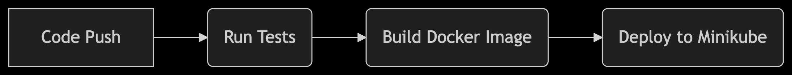

# Node.js CI/CD Pipeline with Kubernetes (Minikube)

A complete CI/CD pipeline for a Node.js application deployed to Kubernetes (Minikube), demonstrating:

- 🐳 Docker containerization
- ☸️ Kubernetes deployment
- ⚡ GitHub Actions automation
- 🧪 Jest testing

## 📦 Prerequisites

- Docker Desktop
- Minikube
- kubectl
- Node.js 18+

## 🚀 Quick Start

### Local Development

# 1. Clone the repo
git clone https://github.com/ArthurVarteressians/Node-CI-CD.git
cd node-ci-cd

# 2. Install dependencies
npm install

# 3. Start the app
npm start

# 4. Start Minikube
minikube start --driver=docker

# 5. Build and deploy
eval $(minikube docker-env)
docker build -t my-node-app .
kubectl apply -f k8s/

# 6. Access the app
minikube service node-app-service --url

